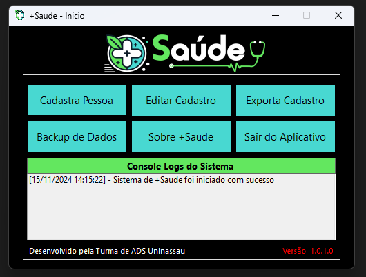
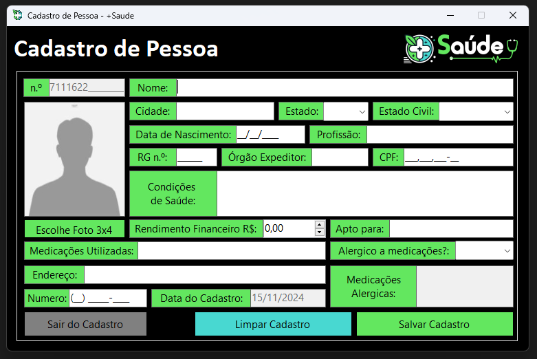
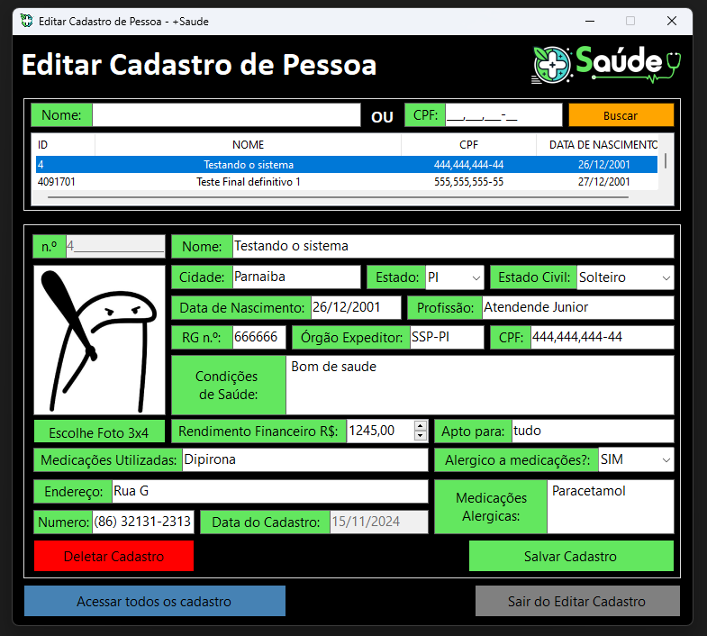
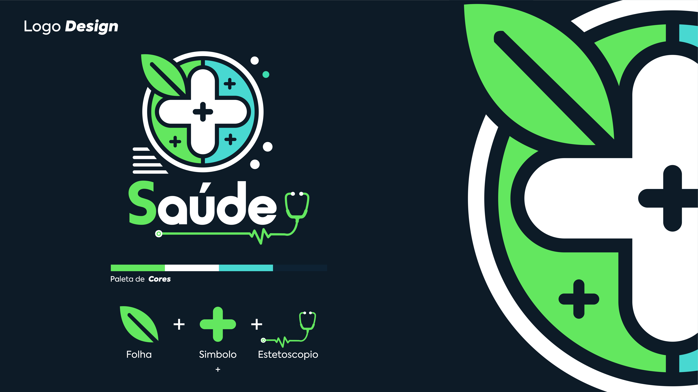

<h1 align="center">
    <a href="#" alt="gerador de card"> +Saude - Gerenciador de Cadastro de Pessoas </a>
</h1>

<h3 align="center">
    Gerenciar cadastros de pessoas fácil e prático. 
</h3>

  

  
  
  
    
   
   
 

<h4 align="center">
	🚧 Construindo 🚧
</h4>

Tabela de conteúdos
=================
<!--ts-->
   * [Sobre o projeto](#-sobre-o-projeto)
   * [Funcionalidades](#-funcionalidades)
   * [Layout](#-layout)
     * [Desktop](#Desktop)
   * [Tecnologias](#-tecnologias)
     * [Desktop](#user-content-website--Desktop----typescript)
   * [Autor](#-autor)
   * [Licença](#user-content--licença)
<!--te-->

## 💻 Sobre o projeto

+Saude - é uma forma de gerenciar cadastros de pessoas de maneira prática rápido e fácil.
Criado pela turma de ADS UniNassau 2024 para o projeto de extenção.

---

## ⚙️ Funcionalidades

- [x] Menu Inicial +Saude:
  - [x] Criar Cadastro 
    - Coletas de dados da pessoa
    - Salvar casdatro
    - Limpar cadastro
    - Sair do cadastro
  - [x] Editar Cadastro
    - Busca cadastro especifico
    - Editar cadastro
    - Limpar cadastro
    - Excluir cadastro
    - Sair do cadastro
    - Busca todos os cadastro
  - [x] Exportar Cadastro 
    - Exportar em aquivo PDF os cadastro de pessoas
    - Escolhe os cadastro que devem ser exportados
  - [x] Backup de Dados
    - Exportar o backup do banco de dados
    - Importar backup do banco de dados
    - Gerar backup
    - Configurar backup
  - [x] Sobre +Saude 
    - Informações sobre o +Saude
    - Versão do aplicativo
  - [x] Sair do aplicativo 
    - fechar o aplicativo
  - [x] Logs do sistema:
    - Mostra todos os logs do sistema

---

## 🎨 Layout

O layout da aplicação é simples e prático.
Identidade visual feita por Eliabe.

### Desktop

  

  

  

  

  

  

  

  

---

## 🛠 Tecnologias

As seguintes ferramentas foram usadas na construção do projeto:

#### **Desktop**  ([c#](https://docs.microsoft.com/pt-br/dotnet/csharp/)  +  [Windows Forms](https://docs.microsoft.com/pt-br/visualstudio/ide/create-csharp-winform-visual-studio?view=vs-2019))

-   **[C# itextsharp](https://www.nuget.org/packages/iTextSharp/)**

> Veja o arquivo  [packages.config](https://github.com/lThiag0/Yugioh-Card-Maker/tree/master/maisSaude/packages.config)

#### **Utilitários**

-   Editor:  **[Visual Studio](https://visualstudio.microsoft.com/pt-br/)**  → And:  **[Visual Studio Code](https://code.visualstudio.com/)**
-   Commit Conventional:  **[Commitlint](https://github.com/conventional-changelog/commitlint)**

---

## 🦸 Autor

<a href="https://github.com/lThiag0/">
 
  
 <b>Thiago Araujo</b></a> <a href="#" title="Coding">Code</a>
  

 

AND
- Gabriel Lopes, Carlos Ellyoram, Rian Santos, Moises, Ana Beatriz, Eduardo, Rayson, Eliabe e Elton

---

## 📝 Licença

Este projeto esta sobe a licença [MIT](./LICENSE).

Feito com ❤️ por Thiago Araujo e Turma de ADS 2024 👋🏽 [Entre em contato!](https://www.linkedin.com/in/thiago-araujo-furtado/)
